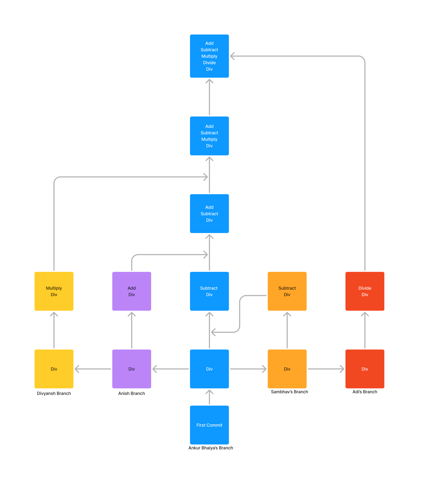

# Collaborative Git Workflow - Project README

This README outlines the structured workflow used for collaborative Git development in our project. It details the process of creating branches, making commits, adding collaborators, and merging work into the main branch.

## Table of Contents
- [Repository Creation](#repository-creation)
- [Initial Commits](#initial-commits)
- [Adding Collaborators](#adding-collaborators)
- [Branch Creation](#branch-creation)
- [Developing Functions and Pushing](#developing-functions-and-pushing)
- [Merging Using Fast-Forward](#merging-using-fast-forward)
- [Handling Non-Linear Merges](#handling-non-linear-merges)
- [Repeating for Other Collaborators](#repeating-for-other-collaborators)
- [Summary](#summary)

---

## Repository Creation
The repository was created as the central project hub, where all collaborators could contribute to a shared codebase.

## Initial Commits
Ankur Bhaiya made 2 initial commits, setting up the foundational structure of the project.

## Adding Collaborators
Four collaborators were added to the repository with permissions to contribute, enhancing the collaborative development process.

## Branch Creation
Each collaborator created a personal branch (e.g., `Sambhav`, `Anish`, etc.) to work independently, avoiding code interference in the main branch.

## Developing Functions and Pushing
Each collaborator developed a unique JavaScript function in their respective branches, committed the changes, and pushed them to the remote repository.

## Merging Using Fast-Forward
A **fast-forward merge** was conducted from `Sambhav's` branch to `main` due to a linear path between the two. In such cases, Git simply moves the main branch pointer to the latest commit in `Sambhav's` branch.

## Handling Non-Linear Merges
When attempting to pull changes from `Anish's` branch, we encountered a **non-linear path**:
1. The main branch already contained changes from `Sambhav's` branch.
2. A **merge commit** was required to integrate `Anish's` changes.

### Steps in Non-Linear Merging:
1. Manual conflict resolution was performed to select the appropriate changes.
2. This process generated:
   - Anish's original commit.
   - A new merge commit to represent the resolved state.

## Repeating for Other Collaborators
The merging process was repeated for each collaborator's branch:
- Conflicts were resolved as needed.
- Additional merge commits were created to keep the main branch updated.

---

## Summary
- **Fast-Forward Merges**: Used for `Sambhav` to `main`, as a linear path existed.
- **Manual Merge Commits**: Required for merging `Anish` and subsequent collaborators due to non-linear paths, allowing conflict resolution and incorporating all changes.
- **Final State**: The main branch now includes contributions from all collaborators, with a mix of fast-forward and merge commits to reconcile linear and non-linear paths.

This collaborative workflow ensured a smooth, organized integration of all contributions, ultimately providing a cohesive codebase in the main branch.
