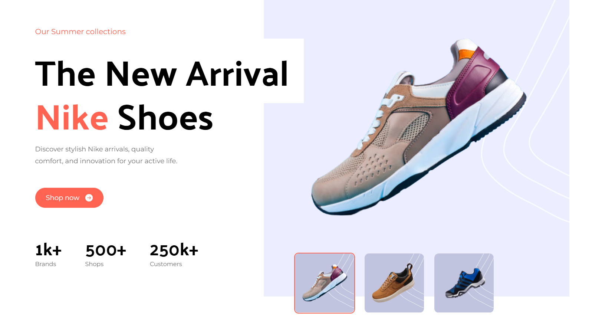
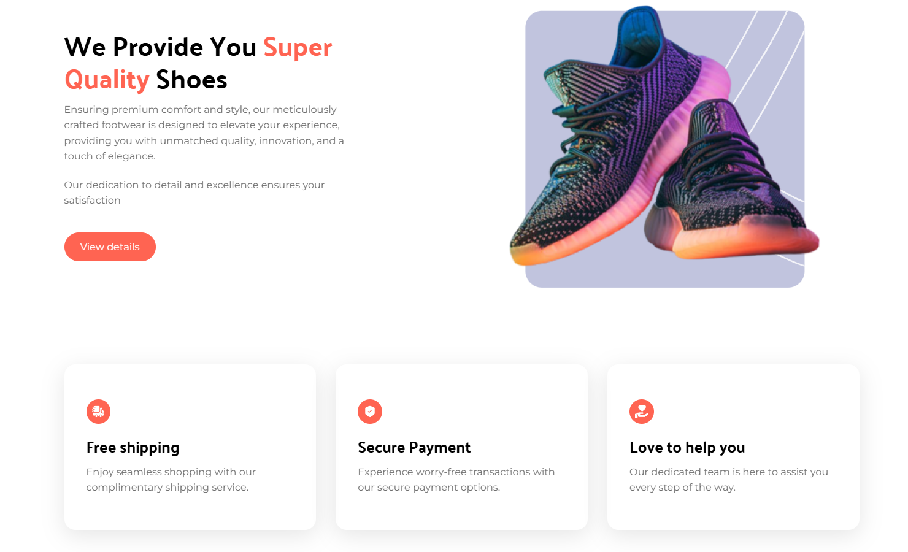
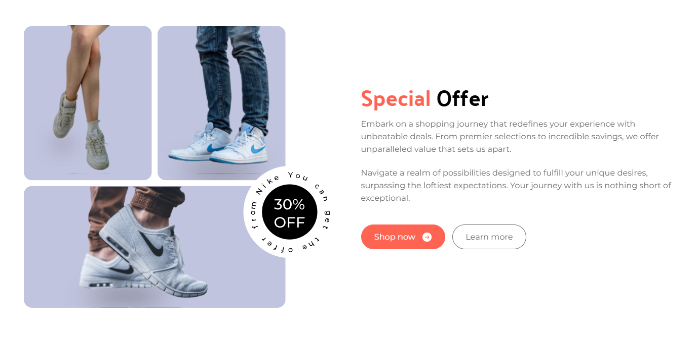

---

# 🌟 **My React Tailwind Project** 🌟

Welcome to my latest project! 🚀 This is a **React-based** web application styled with **Tailwind CSS** for sleek responsiveness and modern design. Let's dive into the details! 🌈

---

## 🖌️ **Project Features**

✨ **Responsive Design:** Fully responsive for devices of all sizes – from mobile to desktop. 📱💻  
✨ **Component-Based Architecture:** Reusable and modular components for scalability and simplicity. 🧩  
✨ **Modern UI with Tailwind CSS:** Tailwind-powered styles for a clean and professional look. 🎨  
✨ **Organized File Structure:** Easy-to-navigate and maintainable project organization. 📂  
✨ **Interactive and Dynamic Content:** Built with React for a seamless user experience. ⚡  

---

## 📁 **Project Structure**

Here's a quick overview of the project's structure:

### 🗂️ **Folders & Components**

1. **`src/assets`** 🎨  
   - **icons/**: Contains all icon assets used throughout the project. 🖼️  
   - **images/**: Stores all the images used for visuals. 📸  

2. **`src/components`** 🧩  
   - **Button.jsx**: Custom button component for consistent styling. 🔘  
   - **Nav.jsx**: Responsive navigation bar for seamless user interaction. 🧭  
   - **PopularProductCard.jsx**: Card component showcasing top-rated products. 🛍️  
   - **ReviewCard.jsx**: Displays user reviews dynamically. ⭐  
   - **ServiceCard.jsx**: Highlights services offered. 🔧  
   - **ShoeCard.jsx**: Specialized card for footwear products. 👟  

3. **`src/sections`** 📜  
   - **Hero.jsx**: Captivating hero section with a headline and call-to-action. ✨  
   - **CustomerReviews.jsx**: Section displaying customer feedback. 🗣️  
   - **Footer.jsx**: Well-structured footer with links and copyright. 📌  
   - **PopularProducts.jsx**: Features the most sought-after products. 🛒  
   - **Services.jsx**: Details about the services provided. 🔑  
   - **SpecialOffer.jsx**: Showcases limited-time offers and deals. 🤑  
   - **Subscribe.jsx**: Call-to-action for newsletters and updates. 📧  
   - **SuperQuality.jsx**: Emphasizes the quality of products or services. 💎  

4. **`src/constants`** 📚  
   - **index.js**: Contains reusable constants for data or configurations. ⚙️  

---

## 🎯 **Technologies Used**

- **React** ⚛️: For building dynamic user interfaces.  
- **Tailwind CSS** 💨: For styling the application with utility-first classes.  
- **JavaScript (ES6)** 🟨: Core programming language for the app logic.  

---

## ✨ **Preview**

Get a glimpse of the project in action! Here's what you'll experience:  
1️⃣ A stunning hero section to grab attention.  

 

2️⃣ Engaging content cards for products, services, and reviews.

 

  
3️⃣ Seamless navigation and interactive components.  

 

---

## 🙌 **Feedback & Contributions**

I’m always looking to improve and grow. If you have suggestions or would like to contribute, feel free to open an issue or submit a pull request. 💡  

---

## 🏆 **Author**

👨‍💻 **Bloivating-Major**  
📧 [sambhav12wakhariya@gmail.com](mailto:sambhav12wakhariya@gmail.com)  

Let’s create something amazing together! 🎉

--- 
