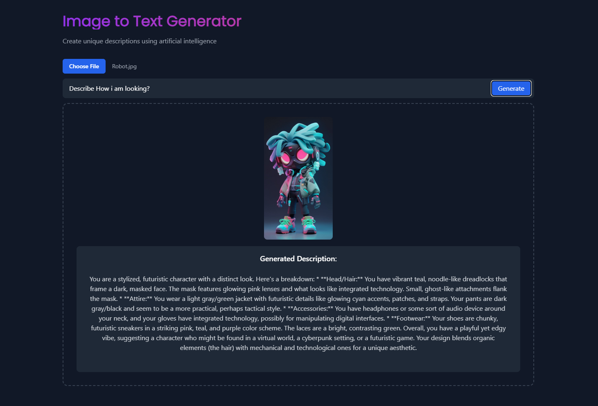

# Week 9 - Day 3: Image to Text Generator 🎨

## Project Overview 📢

This exciting React app challenge was to create an **Image to Text Generator** application. The project involved uploading an image, analyzing it using Google Generative AI, and generating a descriptive text based on a user-provided prompt. It pushed our React and API integration skills to the next level!

---

## Features 🔄

### Key Functionalities:
1. **Image Upload**:
   - Users can upload any image file which gets displayed in the app.

2. **Custom Prompt Input**:
   - Users provide a description prompt to guide the text generation.

3. **AI-Powered Text Generation**:
   - Integration with Google Generative AI API (Gemini-1.5-pro) to analyze the uploaded image and generate descriptive text.

4. **Responsive UI**:
   - Built a clean, intuitive interface using **Tailwind CSS**.

---

## Learnings and Skills Gained 🕵️

- **React Basics**: Handling state and props effectively for dynamic content.
- **File Handling**: Uploading and processing image files in React.
- **API Integration**: Communicating with external APIs and handling responses.
- **UI/UX Design**: Creating responsive, user-friendly interfaces with Tailwind CSS.
- **Asynchronous Code**: Managing async operations with proper error handling.

---

## Code Snippets 🔧

### File Upload Handler
```javascript
const handleFileChange = (event) => {
  const file = event.target.files[0];
  if (!file) return;

  setSelectedImage(URL.createObjectURL(file));
  setImageFile(file);
};
```

### API Integration
```javascript
const handleSubmit = async (e) => {
  e.preventDefault();
  if (!imageFile || !prompt) {
    setGeneratedText("Please upload an image and provide a prompt.");
    return;
  }

  setLoading(true);

  try {
    const genAI = new GoogleGenerativeAI(import.meta.env.VITE_GEMINI_API_KEY);
    const model = genAI.getGenerativeModel({ model: "gemini-1.5-pro" });

    const base64Image = await fileToBase64(imageFile);

    const imagePart = {
      inlineData: {
        data: base64Image,
        mimeType: imageFile.type,
      },
    };

    const result = await model.generateContent([prompt, imagePart]);
    const response = await result.response;
    const text = await response.text();
    setGeneratedText(text);
  } catch (error) {
    console.error("Error analyzing image:", error);
    setGeneratedText("Error analyzing image. Please try again.");
  } finally {
    setLoading(false);
  }
};
```

---

## Challenges Faced 🚫

1. **Image Encoding**:
   - Converting images to Base64 for API requests was tricky but rewarding.

2. **API Debugging**:
   - Troubleshooting response formats and handling errors.

3. **UI Feedback**:
   - Ensuring smooth user experience with loading indicators and error messages.

---

## App Showcase 🚀
<div>

</div>

### User Workflow:
1. Upload an image.
2. Enter a custom prompt.
3. Click the "Generate" button.
4. View the descriptive text output below the image.

### Highlights:
- **Real-Time Feedback**: Visual cues for loading and errors.
- **Dynamic JSX Rendering**: Outputs are neatly displayed and styled.
- **Minimalistic Design**: Responsive layout ensuring accessibility.

---

## Final Thoughts 🙏

This project demonstrated the power of combining React with AI. It’s an excellent example of a user-centric app leveraging cutting-edge technologies. 

> "Creativity meets technology for impactful solutions!"

